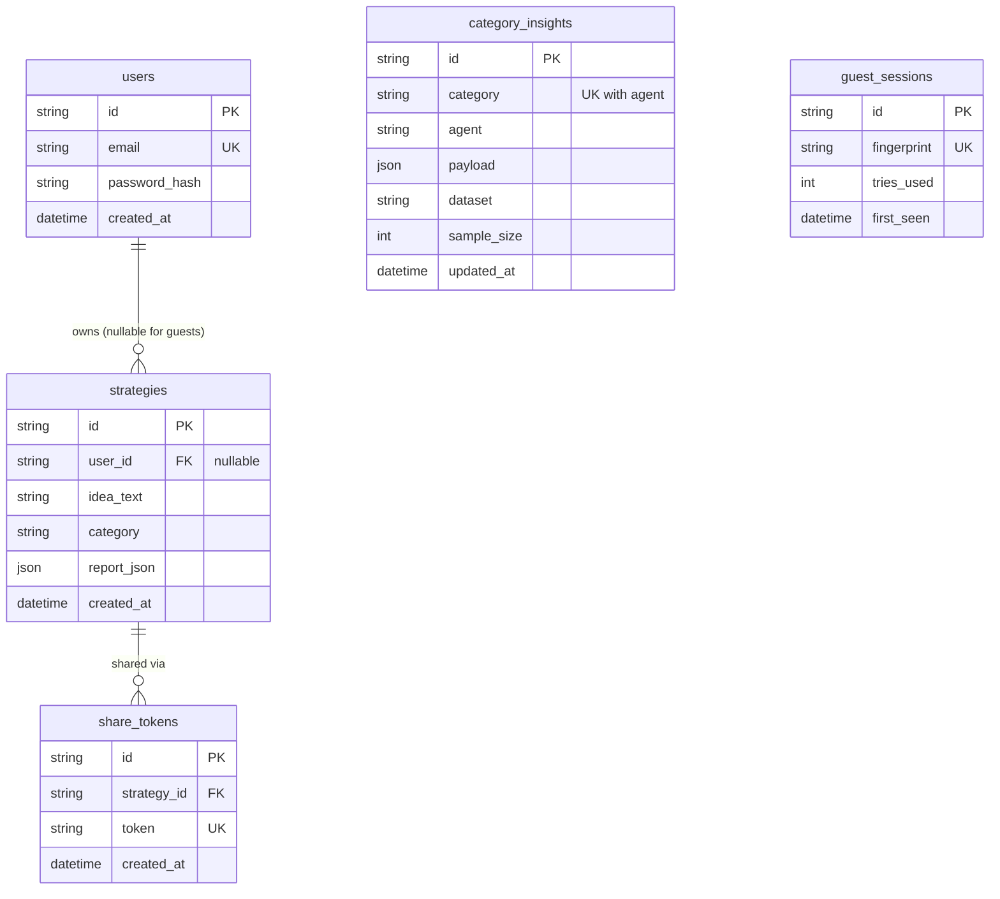

# ER Diagram — Schema v1

```mermaid
erDiagram
    users ||--o{ strategies : "owns (nullable for guests)"
    strategies ||--o{ share_tokens : "shared via"
    users {
        string id PK
        string email UK
        string password_hash
        datetime created_at
    }
    strategies {
        string id PK
        string user_id FK "nullable"
        string idea_text
        string category
        json report_json
        datetime created_at
    }
    category_insights {
        string id PK
        string category "UK with agent"
        string agent
        json payload
        string dataset
        int sample_size
        datetime updated_at
    }
    guest_sessions {
        string id PK
        string fingerprint UK
        int tries_used
        datetime first_seen
    }
    share_tokens {
        string id PK
        string strategy_id FK
        string token UK
        datetime created_at
    }
```

`category_insights` is intentionally unlinked: it stores precomputed offline
agent results keyed by (category, agent) — the "precompute heavy, serve light" table.
